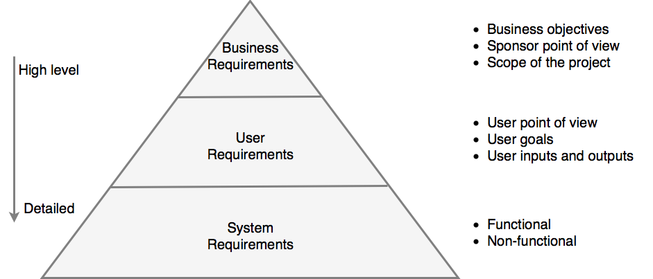

## Table of Contents

- [Overview](#overview)

## Overview

Requirements are statements about an intended product which specify what it should do or how to do it. For requirements to be effectively implemented and measured, they must be specific, unambiguous and clear.

    

## Goal

1. Create a better understanding of the business needs to contribute to a successful software development process.

2. Risk reduction. A good project planner clears major risks out of the way as early as possible so that the bulk of the project can proceed as smoothly as possible. By far the most common project risks in software development are poor requirements and poor project planning, thus preparation tends to focus on improving requirements and project plans.

## Causes Of Incomplete Preparation

* Developers do not know how to do upstream work.
* Managers are notoriously unsympathetic to programmers who spend time on construction prerequisites.

## Utterly Compelling And Foolproof Argument For Doing Prerequisites Before Construction

From a management point of view, planning means determining the amount of time, number of people, and number of computers the project will need.

From a technical point of view, planning means understanding what you want to build so that you do not want to spend a lot of time and money going down blind alleys when there is no need to, especially when that increases costs.

Researchers at Hewlett-Packard, IBM, Hughes Aircraft, TRW, and other organizations have found that purging an error by the beginning of construction allows rework to be done 10 to 100 times less expensively than when it’s done in the last part of the pro- cess

### Table 1 - Average Cost of Fixing Defects Based On When They Are Introduced And Detected

| **Time Introduced** | Requirements | Architecture | Construction | System Test | Post-Release |
| :---: | :---: | :---: | :---: | :---: | :---: |
| Requirements | 1 | 3 | 5-10 | 10 | 10-100 |
| Architecture | - | 1 | 10 | 15 | 25-100 |
| Construction | - | - | 1 | 10 | 10-25 |

The data in Table 1 shows that, for example, an architecture defect that costs $1000 to fix when the architecture is being created can cost $15,000 to fix during system test.

## Determine The Kind Of Software You Are Working On

Business systems projects tend to benefit from highly iterative approaches, in which planning, requirements, and architecture are interleaved with construction, system testing, and quality-assurance activities.

Life-critical systems tend to require more sequential approaches — requirements stability is part of what is needed to ensure ultrahigh levels of reliability.

## Iterative Approaches’ Effect On Prerequisites

Iterative approaches tend to reduce the impact of inadequate upstream work, but they do not eliminate it.

### Table 1 - Effect Of Skipping Prerequisites On Sequential And Iterative Projects

|  | Approach #1: Sequential Approach Without Prerequisites |  | Approach #2: Iterative Approach Without Prerequisites |  |
| :---: | :---: | :---: | :---: | :---: |
| **Project Completion Status** | **Cost Of Work** | **Cost Of Rework** | **Cost Of Work** | **Cost Of Rework** |
| 20% | $100,000 | $0 | $100,000 | $75,000 |
| 40% | $100,000 | $0 | $100,000 | $75,000 |
| 60% | $100,000 | $0 | $100,000 | $75,000 |
| 80% | $100,000 | $0 | $100,000 | $75,000 |
| 100% | $100,000 | $0 | $100,000 | $75,000 |
| **End-Of-Project Rework** | $0 | $500,000 | $0 | $0 |
| **Total** | $500,000 | $500,000 | $500,000 | $375,000 |
| **Grand Total** |  | $1,000,000 |  | $1,000,000 |

### Table 1 - Effect Of Focusing On Prerequisites On Sequential And Iterative Projects

|  | Approach #1: Sequential Approach With Prerequisites |  | Approach #2: Iterative Approach With Prerequisites |  |
| :---: | :---: | :---: | :---: | :---: |
| **Project Completion Status** | **Cost Of Work** | **Cost Of Rework** | **Cost Of Work** | **Cost Of Rework** |
| 20% | $100,000 | $20,000 | $100,000 | $10,000 |
| 40% | $100,000 | $20,000 | $100,000 | $10,000 |
| 60% | $100,000 | $20,000 | $100,000 | $10,000 |
| 80% | $100,000 | $20,000 | $100,000 | $10,000 |
| 100% | $100,000 | $20,000 | $100,000 | $10,000 |
| **End-Of-Project Rework** | $0 | $0 | $0 | $0 |
| **Total** | $500,000 | $100,000 | $500,000 | $50,000 |
| **Grand Total** |  | $600,000 |  | $550,000 |

## Choosing Between Iterative And Sequential Approaches

You might choose a more sequential (up-front) approach when

* The requirements are fairly stable.
* The design is straightforward and fairly well understood.
* The development team is familiar with the applications area.
* The project contains little risk.
* Long-term predictability is important.
* The cost of changing requirements, design, and code downstream is likely to be high.

You might choose a more iterative (as-you-go) approach when

* The requirements are not well understood or you expect them to be unstable for other reasons.
* The design is complex, challenging, or both.
* The development team is unfamiliar with the applications area.
* The project contains a lot of risk.
* Long-term predictability is not important.
* The cost of changing requirements, design, and code downstream is likely to be low.

## Problem-Definition Prerequisite

The first prerequisite you need to fulfill before beginning construction is a clear state- ment of the problem that the system is supposed to solve.

A problem definition defines what the problem is without any reference to possible solutions. It’s a simple statement, maybe one or two pages, and it should sound like a problem.

The problem definition should be in user language, and the problem should be described from a user’s point of view

The penalty for failing to define the problem is that you can waste a lot of time solving the wrong problem. This is a double-barreled penalty because you also do not solve the right problem.

Requirements describe in detail what a software system is supposed to do, and they are the first step toward a solution.

## Sources

1. [Code Complete (2nd edition), Steve McConnell, 2004](https://en.wikipedia.org/wiki/Code_Complete)
2. [Gathering Good Requirements for Developers, Robert Bogue, 2014](https://www.pluralsight.com/courses/gathering-good-requirements-developers)