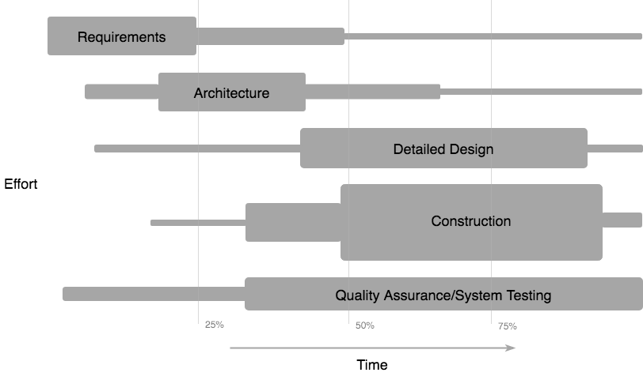

# Software Development Life Cycle

SDLC done right can allow the highest level of management control and documentation.
Developers understand what they should build and why.
All parties agree on the goal up front and see a clear plan for arriving at that goal.
Everyone understands the costs and resources required.

## Software Development Process

Software development process is the process of dividing software development work
into distinct stages to improve management and final product.

    

1. Requirements analysis encompasses those tasks that go into determining the needs or conditions
to meet for a product.
1. ...

## Software Development Methodologies

Software development methodology is a set of related activities that leads to the production of the software.

waterfall
iterative
spiral
v-model
agile
https://www.pinterest.com/pin/355362226828550368/

https://stackify.com/what-is-sdlc/

## Software Development Roles

The responsibilities of the people involved in the process.

## Team Managment

    

Colors:
- #007fff
- #808080 / #A6A6A6
- #ff7f00

Images:
- [pngall](http://www.pngall.com)
