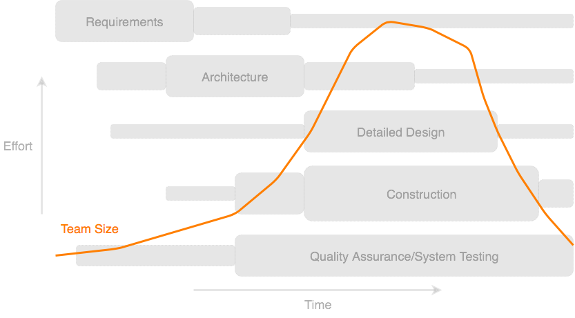

# Software Development Life Cycle

SDLC done right can allow the highest level of management control and documentation.
Developers understand what they should build and why.
All parties agree on the goal up front and see a clear plan for arriving at that goal.
Everyone understands the costs and resources required.

## Software Development Process

Software development process is the process of dividing software development work
into distinct stages to improve management and final product.

    

1. Requirements analysis encompasses those tasks that go into determining the needs or conditions
to meet for a product.
1. Design phase starts by turning the software specifications into architecture solution.
1. Construction stage develops the software by generating all the actual code.
1. In testing stage, we test for defects and deficiencies. Fix those issues until the product meets the original specifications.

## Software Development Methodologies

Software development methodology is a framework that is used to structure, plan, and control the process of developing software application. The two basic, most popular methodologies are:
- Waterfall is a linear approach to software development.
- Agile is an iterative, team-based approach to development.

    

Also, there are several more models, e.g. iterative, v-shaped, big bang, spiral and etc.

https://stackify.com/what-is-sdlc/

https://agilewheel.com/2016/09/27/agile-vs-waterfall-which-one-to-use-and-for-what-projects/

http://www.itinfo.am/eng/software-development-methodologies/

## Software Development Roles

The responsibilities of the people involved in the process.

- Business Analist
- Solutions Architect
- Development Lead
- Developer
- Quality Assurance

## Team Managment

    

Colors:
- #007fff
- #808080 / #A6A6A6
- #ff7f00

Images:
- [pngall](http://www.pngall.com)
